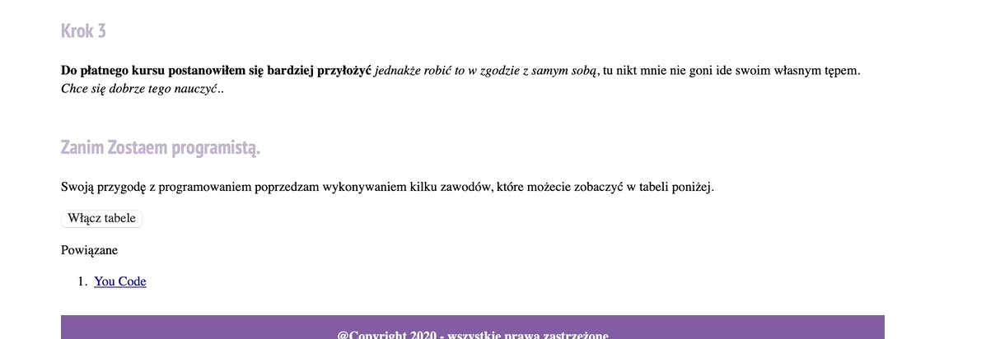

# Bernard Daszkowski - my first website

## Demo

[Bernard's website](https://bernarddaszkowski.github.io/Homepage/)

## Opis

Welcome to my first website. It shows the way of my decision to become professional frontend developer. To be honest this is the begining of my journey in the world of web developing. However, I would like to show my learning proccess through the amount of commits. Button in section 'zanim zostałem programistą' is used for showing/hiding table with my past experience. 

## Used technologies
- BEM
- ES6+ features